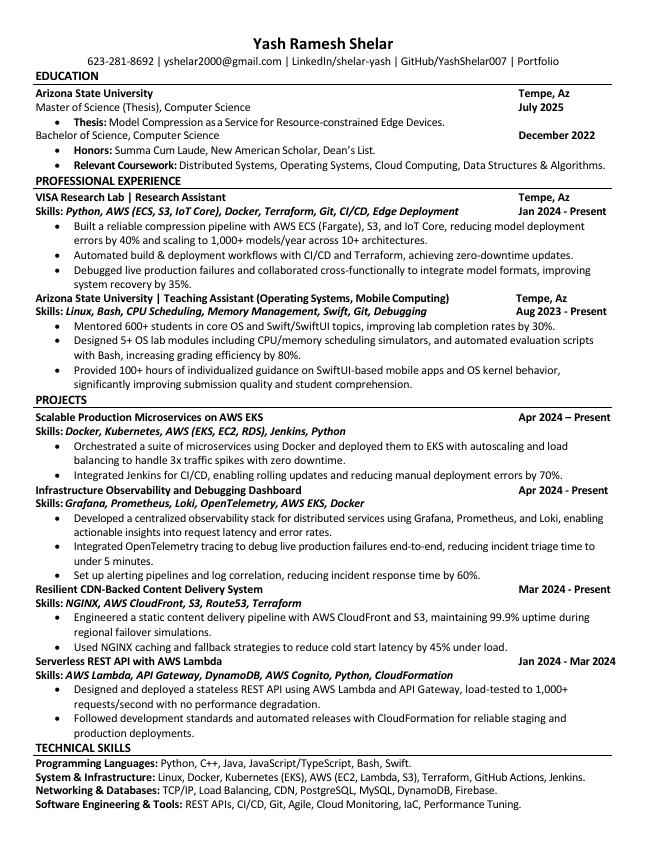

# 📄 Yash Shelar — LaTeX Resume

A single-page, ATS-optimized resume written in LaTeX. Designed for software engineering roles in FAANG, HFT, and high-growth startups. This resume uses clean typography, consistent formatting, and GitHub Actions to automate PDF builds.

---

## 📌 Why This Exists

Managing a resume in Google Docs or Word was error-prone and formatting inconsistencies were hard to control. This LaTeX-based setup offers:

- 🔹 One-column, one-page layout (ideal for recruiters and online applications)
- 🔹 Easy section reordering or styling via custom LaTeX commands
- 🔹 Version control with Git + GitHub
- 🔹 Automatic PDF generation using GitHub Actions + Docker

---

## 🚀 Quick Start (Edit with Overleaf)

1. Visit [Overleaf](https://overleaf.com)
2. Create a new project and upload `yash_shelar_resume.tex`
3. Edit, compile, and download PDF instantly

---

## 🐳 Build Locally with Docker

To compile the PDF locally using Docker:

```bash
docker build -t latex .
docker run --rm -i -v "$PWD":/data latex pdflatex yash_shelar_resume.tex
````

Or use the included `build.sh`:

```bash
bash build.sh
```

---

## ⚙️ GitHub Actions CI

Every commit to `main` automatically builds the PDF using LaTeX in a Docker container.

* Output is uploaded as a build artifact under the [Actions](../../actions) tab.
* No LaTeX setup needed locally.

---

## ✏️ Customization

Want to add tailored versions (Google, HFT, etc.)?

1. Duplicate `yash_shelar_resume.tex` to `resume_google.tex`, `resume_hft.tex`, etc.
2. Modify `build.sh` and workflow to compile each version

---

## 🖼️ Preview



---

## 📄 License

Format is under the [MIT License](LICENSE), but all resume content and data is © Yash Ramesh Shelar.

Feel free to fork and customize the LaTeX structure for your own use — but do not copy the content.